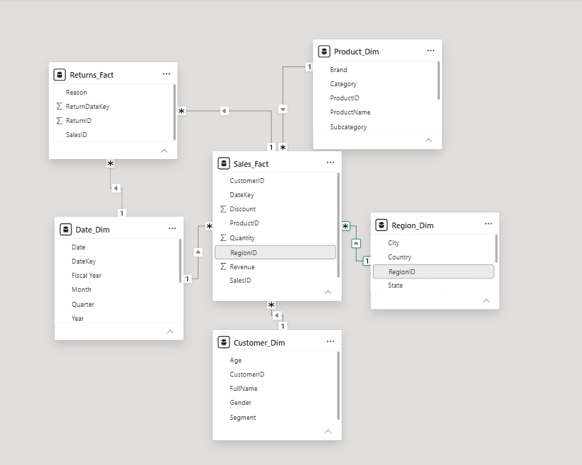
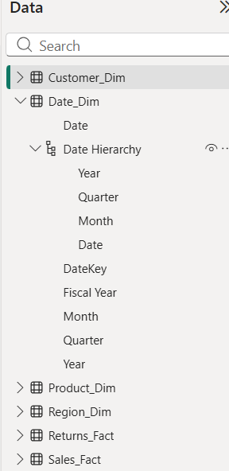
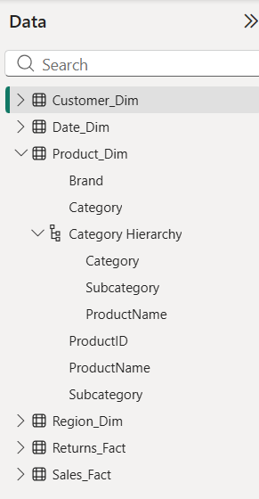
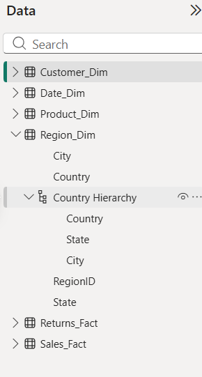
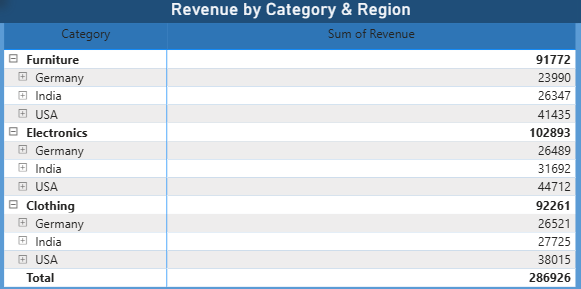
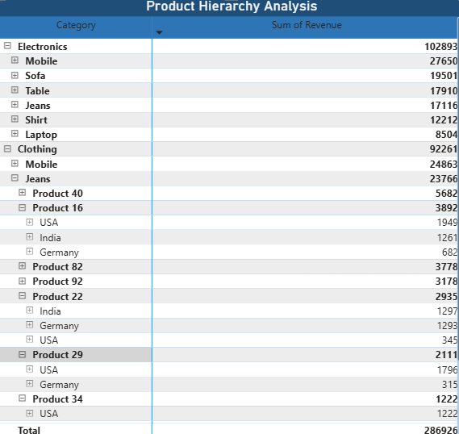
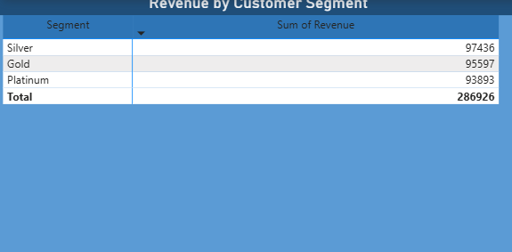
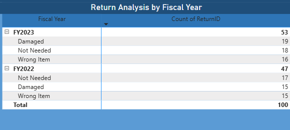
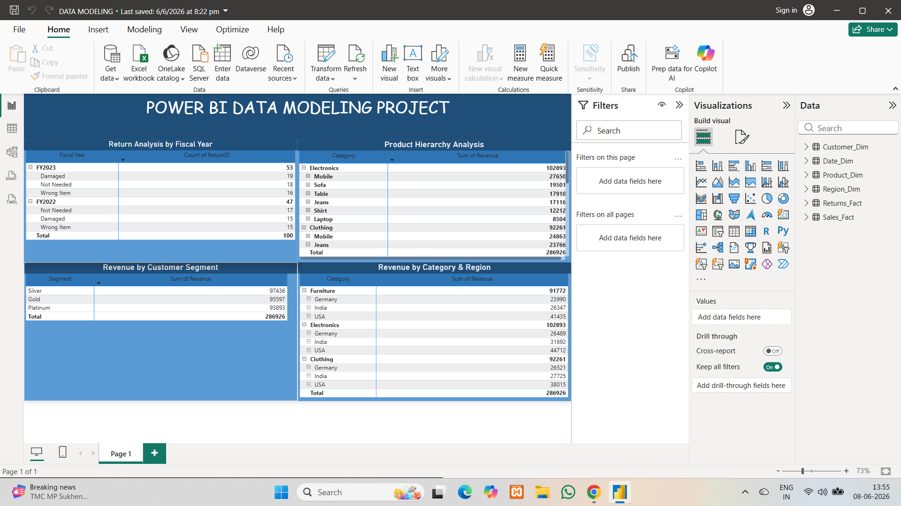

# 📊 Power BI Data Modeling Project

## Project Overview

This project demonstrates the implementation of a Star Schema Data Model in Power BI using fact and dimension tables. The project focuses on data modeling, relationships, hierarchies, and matrix-based validation.

---

## Dataset Structure

### Fact Tables

* Sales_Fact
* Returns_Fact

### Dimension Tables

* Customer_Dim
* Product_Dim
* Region_Dim
* Date_Dim

---

## Data Model

The Sales_Fact table acts as the central fact table connected to all dimension tables.

### Relationships

* Customer_Dim → Sales_Fact
* Product_Dim → Sales_Fact
* Region_Dim → Sales_Fact
* Date_Dim → Sales_Fact
* Sales_Fact → Returns_Fact

### Inactive Relationship

* Returns_Fact[ReturnDateKey]
* Date_Dim[DateKey]

---

## Hierarchies Created

### Date Hierarchy

Year → Quarter → Month → Date

### Product Hierarchy

Category → Subcategory → ProductName

### Region Hierarchy

Country → State → City

---

## Verification Matrices

* Revenue by Category & Region
* Product Hierarchy Analysis
* Revenue by Customer Segment
* Return Analysis by Fiscal Year

---

## Screenshots

### Data Model

### Date Hierarchy

### Product Hierarchy

### Region Hierarchy

### Revenue by Category & Region

### Product Hierarchy Analysis

### Revenue by Customer Segment

### Return Analysis by Fiscal Year

### Full View

---

## Tools Used

* Power BI Desktop
* Power Query
* Data Modeling
* Star Schema Design
* GitHub

---

## Author

Nilay Ahir
